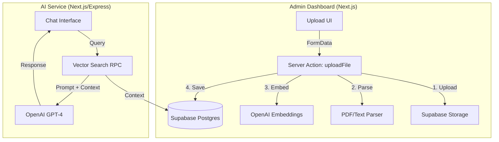

# Phase 3B: Serverless RAG Implementation

**Status**: 🚧 Ready to Start
**Goal**: Implement RAG ingestion and retrieval using Next.js Server Actions and Supabase Vector.
**Tech Stack**: Next.js 15, Supabase (pgvector), Vercel AI SDK (Core), OpenAI Embeddings.

---

## 📋 Overview

We are shifting from a standalone Microservice to a **Serverless Architecture** integrated directly into the Next.js Admin Dashboard and AI Service.

1.  **Ingestion (Admin Dashboard)**:

    - Admins upload files via the UI.
    - A **Server Action** processes the file, generates embeddings, and saves to Supabase.
    - **Why?** Simpler infrastructure, direct access to Supabase, no extra hosting costs.

2.  **Storage (Supabase)**:

    - Files stored in Supabase Storage (`documents` bucket).
    - Embeddings stored in Postgres `documents` table with `pgvector`.

3.  **Retrieval (AI Service)**:
    - The Chatbot (AI Service) queries Supabase directly to find relevant context.
    - Generates answers using Vercel AI SDK.

---

## 🏗️ Architecture



---

## 💾 Database Schema (Supabase)

We need to enable `pgvector` and create a table for documents.

```sql
-- Enable the pgvector extension to work with embedding vectors
create extension if not exists vector;

-- Create a table to store your documents
create table documents (
  id bigserial primary key,
  content text, -- The text chunk
  metadata jsonb, -- { filename: "policy.pdf", page: 1, college_id: "..." }
  embedding vector(1536) -- OpenAI embedding (1536 dimensions)
);

-- Create a function to search for documents
create or replace function match_documents (
  query_embedding vector(1536),
  match_threshold float,
  match_count int
)
returns table (
  id bigint,
  content text,
  metadata jsonb,
  similarity float
)
language plpgsql
as $$
begin
  return query
  select
    documents.id,
    documents.content,
    documents.metadata,
    1 - (documents.embedding <=> query_embedding) as similarity
  from documents
  where 1 - (documents.embedding <=> query_embedding) > match_threshold
  order by documents.embedding <=> query_embedding
  limit match_count;
end;
$$;
```

---

## 🚀 Implementation Steps

### **Step 1: Admin Dashboard - Ingestion**

**Location**: `services/admin-dashboard`

1.  **Install Dependencies**:

    ```bash
    npm install ai @ai-sdk/openai pdf-parse mammoth
    npm install -D @types/pdf-parse
    ```

2.  **Configure OpenAI**:

    - Ensure `OPENAI_API_KEY` is in `.env.local`.

3.  **Create Server Action (`src/app/actions/upload-document.ts`)**:

    - Input: `FormData` (file, collegeId).
    - Logic:
      1.  Upload file to Supabase Storage bucket `documents`.
      2.  Read file buffer.
      3.  Extract text (using `pdf-parse` for PDFs).
      4.  Chunk text (e.g., 1000 characters).
      5.  Generate embeddings using `embedMany` from Vercel AI SDK.
      6.  Insert rows into `documents` table.

4.  **Connect UI**:
    - Update `src/app/dashboard/uploads/page.tsx` to call the Server Action.

### **Step 2: AI Service - Retrieval**

**Location**: `services/text-chatbot` (Renaming to `ai-service`)

1.  **Install Dependencies**:

    ```bash
    npm install @supabase/supabase-js ai @ai-sdk/openai
    ```

2.  **Create Search Tool/Function**:

    - Use `supabase.rpc('match_documents', { ... })` to find relevant chunks.

3.  **Update Chat Logic**:
    - Inject retrieved context into the system prompt.

---

## 🔮 Future Optimization: Supabase Edge Functions

**Problem**: Next.js Server Actions on Vercel (Free/Pro) have execution time limits (10s/60s). Processing large PDFs might time out.

**Solution**: Offload processing to **Supabase Edge Functions**.

**How it works**:

1.  **Upload**: Admin Dashboard uploads file to Supabase Storage _only_.
2.  **Trigger**: A Database Webhook watches the `storage.objects` table.
3.  **Process**: When a new file is detected, Supabase triggers an Edge Function (`process-document`).
4.  **Execution**: The Edge Function (Deno/TypeScript) runs in the background:
    - Downloads the file.
    - Extracts text.
    - Generates embeddings.
    - Saves to DB.

**Why not now?**

- Server Actions are easier to implement and debug for the MVP.
- We can switch to Edge Functions later without changing the UI (just remove the processing logic from the Server Action).
